# Report

## Learning Algorithm

Because the project requires to handle a continuous action space, then policy gradient methods is a natural choice for the agent training.  

There are several problems with REINFORCE algorithm:

* The update process is very inefficient! We run the policy once, update once, and then throw away the trajectory.
* The gradient estimate is very noisy. By chance, the collected trajectory may not be representative of the policy.
* There is no clear credit assignment. A trajectory may contain many right/wrong actions and whether these actions are reinforced depends only on the final total output.

### Improvements to REINFORCE algorithm

#### Noise Reduction

* To maximize the rewards \U(\theta) we should optimize the policy, which is a sum over all the possible trajectories
  
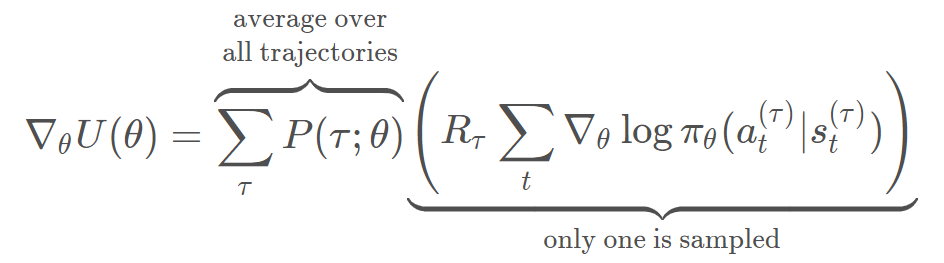

* Since a number of trajectories might be several millions, we chose to update the gradient after each trajectory. The result of a sampled trajectory comes down to chance and doesn't contain much of information about our policy. Learning happens only when an agent collects many trajectories, and the weak signal accumulates.
  
* The most natural improvement would be to sample several trajectories in parallel. Then we can estimate the policy gradient by averaging over all the trajectories.
  
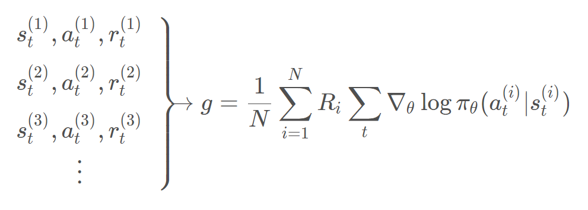

#### Rewards Normalization

* In case of collecting several trajectories in parallel, should get a sense of how the rewards are distributed.
  
* Learning can be improved if we normalize the rewards, where μ is the mean, and σ the standard deviation.

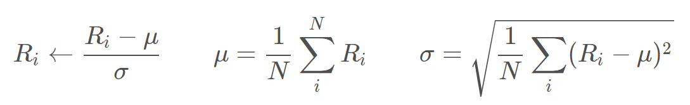

#### Credit Assignment

* R is the total reward that is a sum of each timestep's partial rewards. The gradient equation is like follows:
  
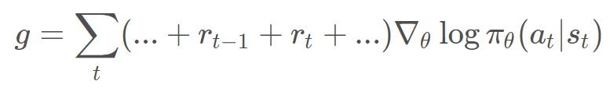

* If we employ a Markov Decision Process kind of thinking, then it states that action at a timestep t only can only affect future reward, so past is not contributing to the policy gradient.
  
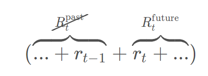

* The better policy gradient would be if we include only future terms as a coefficient.
  
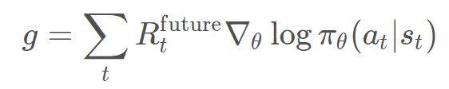
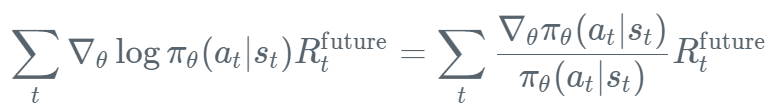

* Notes on Gradient Modification
    * it is okay to change our gradient, and it wouldn't that change our original goal of maximizing the expected reward because it turns out that mathematically, ignoring past rewards might change the gradient for each specific trajectory, but it doesn't change the averaged gradient. So even though the gradient is different during training, on average, we are still maximizing the average reward. The resultant gradient is less noisy, so training using future reward should speed things up!

#### Importance Sampling

* In REINFORCE algorithm, the agent samples the actions on episode based on current probability (policy). After collecting episodes, we compute a gradient of the policy, and then weights (\theta) are updated to improve the decision making of the agent. Finally, the collected episodes are discarded because they are bound to the probability they were sampled from. If we want to update the policy again, we would need to generate episodes based on an updated policy. It is wasteful. It would be better if we could reuse the sampled episodes to compute gradients, and to update our policy, again, and again.

* The trajectories are generated by using old policy. Now, by chance, the same trajectory (actions) could be sampled under a new policy, with a different probability.
  
* Let's say we want to find the average of some quantity f(\tau). Then, this is equivalent to adding up all the f(\tau), weighted by a probability of sampling each trajectory under the new policy.
  
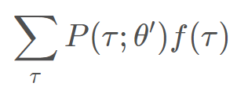

* We can find a relation of the old to a new policy by multiplying and dividing by the old probability.
  
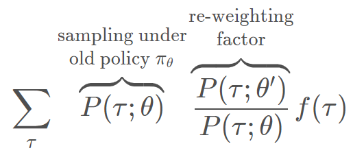

* Because each trajectory contains many steps, the probability contains a chain of products of each policy at different time-steps. The problem arises when some of the policy gets close to zero, the re-weighting factor can become close to zero, or worse, close to 1 over 0 which diverges to infinity. In practice, we want to make sure the re-weighting factor is not too far from 1 when we utilize importance sampling.
  
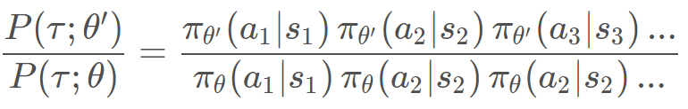

#### The Surrogate Function

* Using importance sampling in the context of policy gradient would lead us to surrogate functions topic. Let us say that we would like to update the current policy, then we compute the gradient g term, but we only have trajectories were generated by the old policies in our disposal. The solution is to use importance sampling as a re-weighting factor to standard gradient term at time-step t.
  
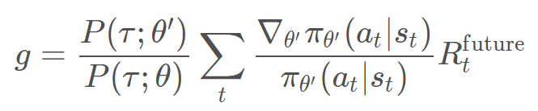

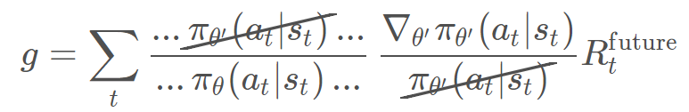

In the equation above, we can cancel the terms that correspond to time-step t. Then we left with terms denoted by "...". If the old and current policy is close to each other, then the ratio would be close to 1. The equation simplifies even further

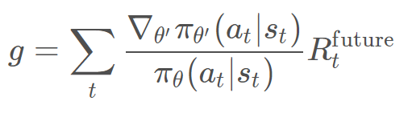

* Note that this time we are comparing two different policies. Let's introduce a surrogate function:
  
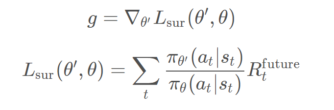

The term is valid until two policies are very similar to each other.

The topic of the surrogate function naturally leads us to discuss Proximal Policy Optimization.

### Proximal Policy Optimization

The Proximal Policy Optimization is a fancier version of REINFORCE and less complicated than TRPO(Trust Region Policy Optimization). TRPO uses KL-divergence to measure how different two policies. PPO instead of KL-divergence uses clipping surrogate function to ensure that a new policy is not much different than an old policy.

#### Clipping Policy Updates

* Clip the surrogate function to ensure the new policy remains close to the old one.
  
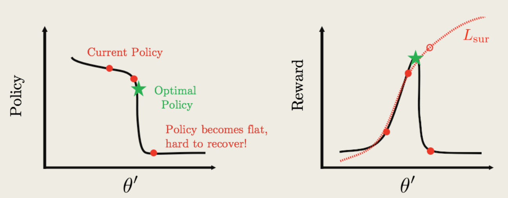

If we would blindly follow the surrogate function for updating the new policy, then Lsurf would take us into the region where there is no optimal solution. Even more than that, it would take us into the region where the gradient of policy would be close to zero, then we would never come back to the optimal solution. The one feasible way to resolve this issue is to clip the surrogate function.

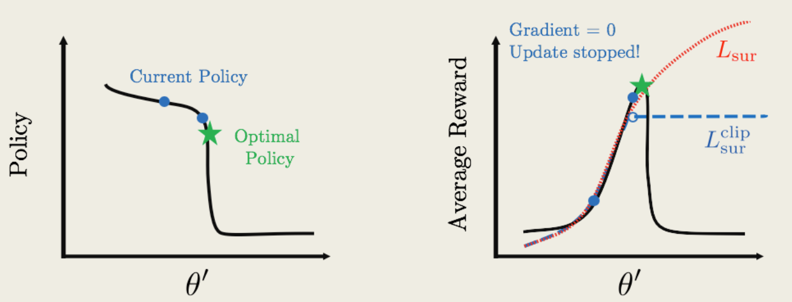

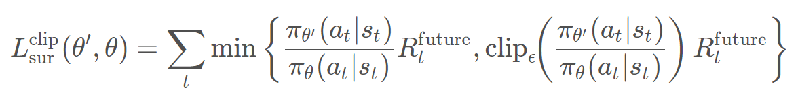

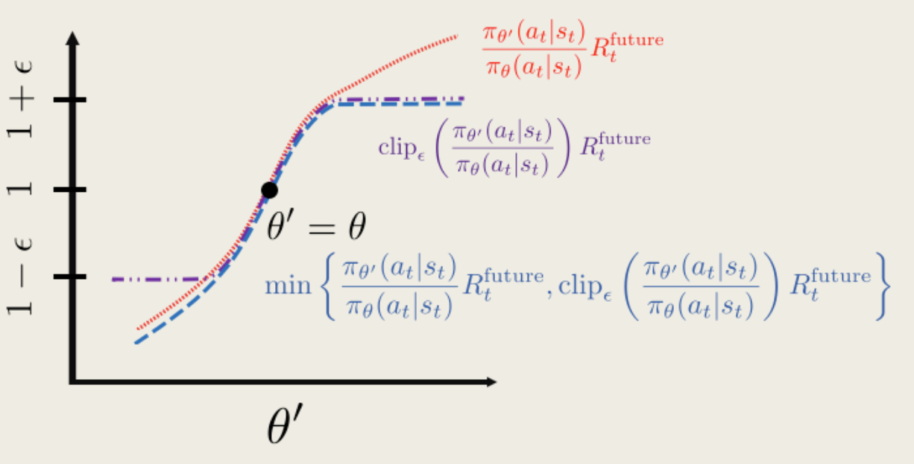

The idea is pretty simple. Since we know that the ratio of a new policy and an old policy has to be in very similar, then we can cap the biggest change, in the positive side, by some constant value epsilon. The lower end stays uncapped because it does not damage the logic of this safeguard.

#### PPO Summary

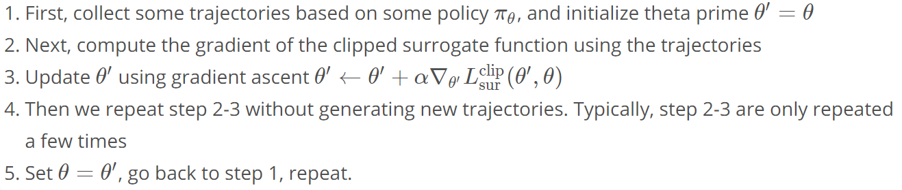

### Actor-Critic methods

#### Motivation

* The Actor-Critic methods use value-based methods and policy-based methods to approximate an optimal policy. As we used REINFORCE with Baseline to reduce the variance of the policy-based method, so we get better and faster learning. The Actor-Critic method uses the action-value as a baseline parameter for the policy-based method.  

#### Baselines and Critics

* Monte-Carlo (random) estimate introduces high variance, but low bias,
* TD estimate (1-step dynamics) introduces low variance, but high bias.

#### Policy-based, Value-based and Actor-Critic

* Policy-based methods (Actor) need to sample many episodes, then it starts to reflect on its behavior.

After repeating the reflection many times, the Actor would increase the probability of taking actions that lead to winning. It is inefficient because it needs lots of data to learn a useful policy.

* Value-based methods (Critics) learns differently. Even before the episode, the agent starts to make guesses on the final score. It is a problem with these methods that guesses introduce bias because of the lack of experience.
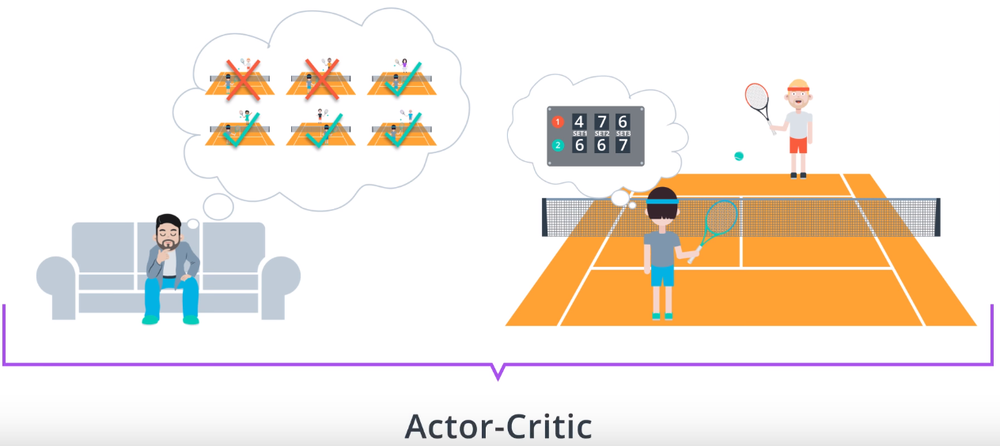

* Actor-Critic agent learns by playing a game and adjusting the probability of good or bad actions like done in a setting where Actor alone, but this time Critic helps to distinguish good or bad actions quickly and speed-up learning.  Actor-Critic agents are more stable than value-based methods and require fewer samples than policy-based methods.

#### A Basic Actor-Critic Agent

* The Critic will learn to evaluate the state-value function Vpi using TD estimate. Using Critic, we will calculate the advantage function and train the Actor by using this value.
* The algorithm works as follows:
    * Using the Actor-network, pass the current state and receive the action to take in the environment.
    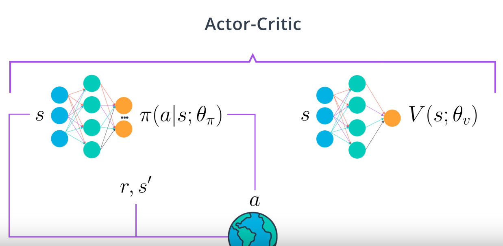
    * Take the action a and collect SARS tuple. Pass the tuple to Critic network and teach.
    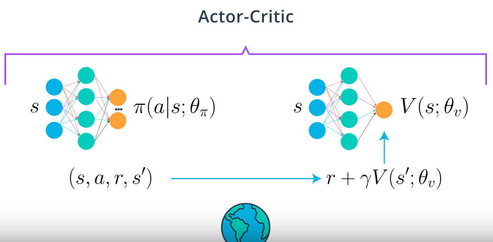
    * Finally calculate the advantage function. Then teach the Actor using calculated advantage function as a baseline.
    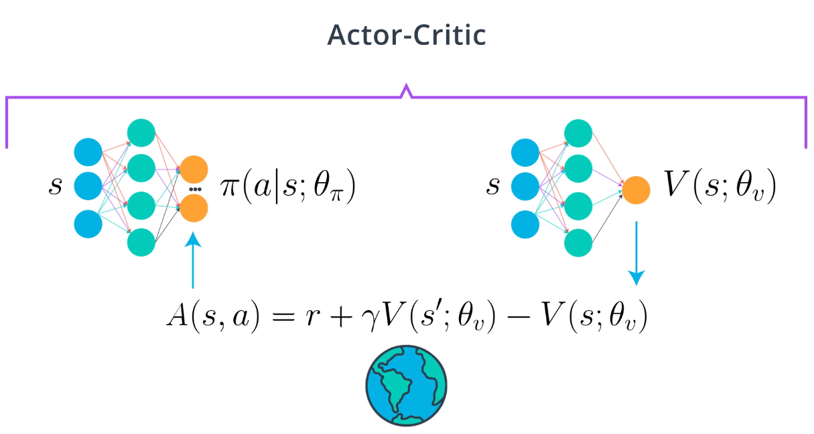

#### A3C: Asynchronous Advantage Actor-Critic, N-step Bootstrapping

* A3C can use the same convolutional neural network with Actor and Critic sharing weights. Sharing weights are more difficult. It is proposed to start with different networks and change it only to improve performance.
* A3C does not use TD estimate but uses N-step Bootstrapping, which kind of the same as TD (1-step boos-trapping), but for N step look ahead. I episode case, it is like having the critic to wait for n-steps to guessing the expected return. In practice, 4 or 5 step Bootstrapping is useful, which allows faster convergence with less experience required while keeping the variance under control.

#### A3C: Asynchronous Advantage Actor-Critic, Parallel Training

* Unlike DQN, A3C does not use a replay buffer.
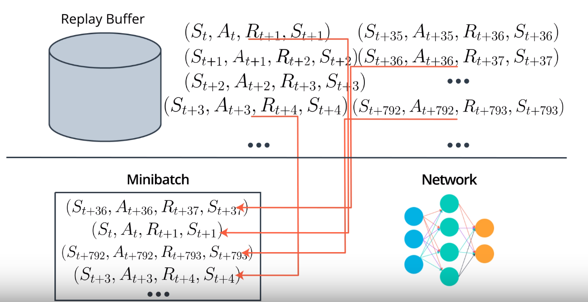
* A3C method replaces the replay buffer by using parallel training. 
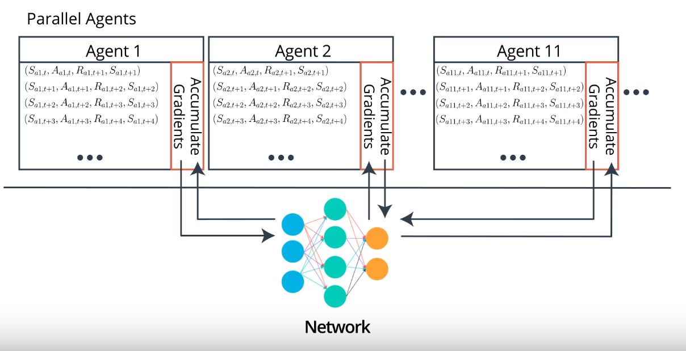

#### A3C: Asynchronous Advantage Actor-Critic, Off-policy vs. On-policy

* On-policy learning is when policy used to interact with the environment is also the policy that is being learned. Like SARSA and A3C.
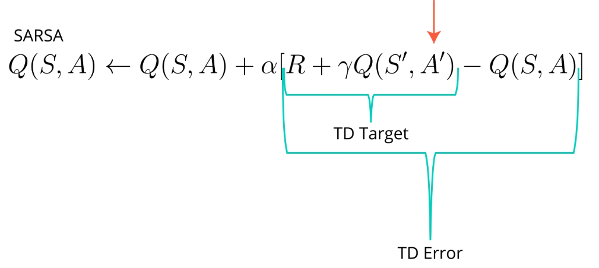
* Off-policy is when the policy is used to interact with the environment is different than the policy is being learned. Like Q learning because of epsilon-greedy. DQN also.
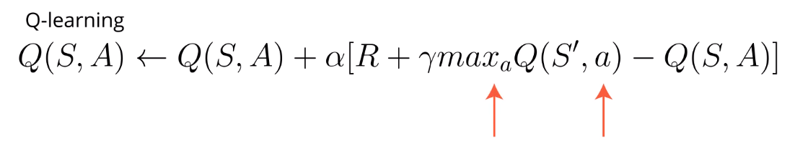
Q-learning learns a deterministic optimal policy even if its behavior policy is random.

* THE ANALOGIES:  On-policy learning some materials would be trying to do all the work by myself. Off-policy learning means that is learning based on some prepared materials like video or block-posts. You can grasp the essential quicker, but it would not be better than on-policy way.  It is better to use in some degree on and off-policy way. The Q-Prop is an example of an agent that uses the Critic off-policy network.

#### A2C: Advantage Actor-Critic

* In A3C Asynchronous stands for multiple agents can access the neural network in its own time, there is no synchronization allowed. It means that agent 1 after finishing running the episodes, passes the experience to train the network getting the result as the new weights.

* A2C does have a synchronization point, where every-agent waits for an end of some trajectory to start training the network. After training, every agent gets a copy of new weights and continue running. It is sometimes better behaving A2C than A3C. A2C is better for GPU implementation.
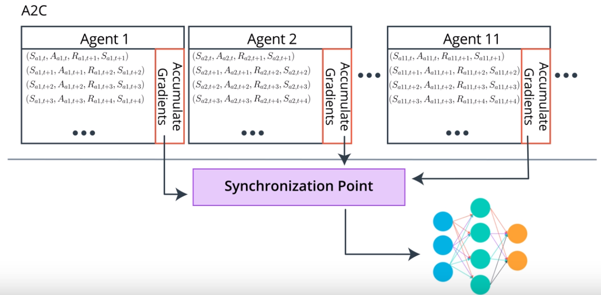

#### GAE: Generalized Advantage Estimation

* Another way to estimate the expected return is called the "Lambda return". It is difficult to choose the number of roll-outs for bootstrapping, which is depended on the environment that an agent observes. The idea of lambda return is to create a mixture of n-step bootstrapping at once.
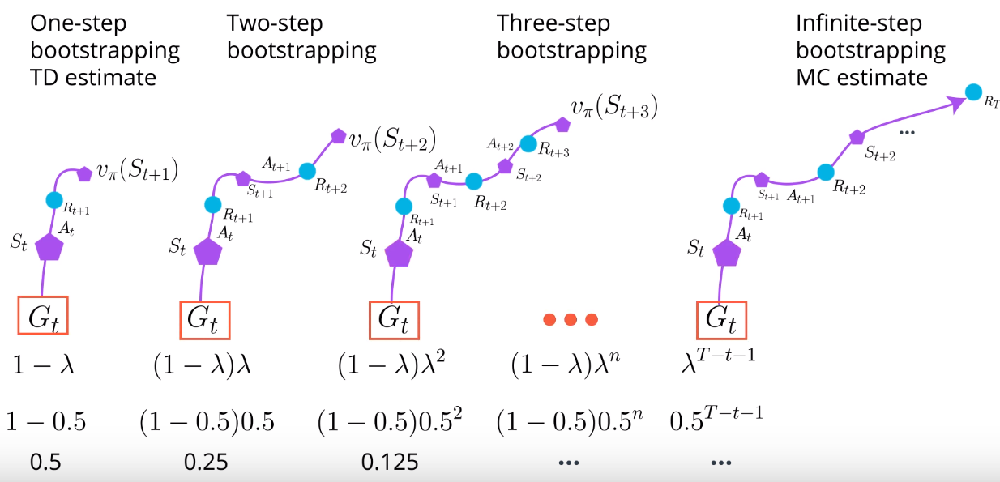
Return is multiplied by the lambda factor like follows
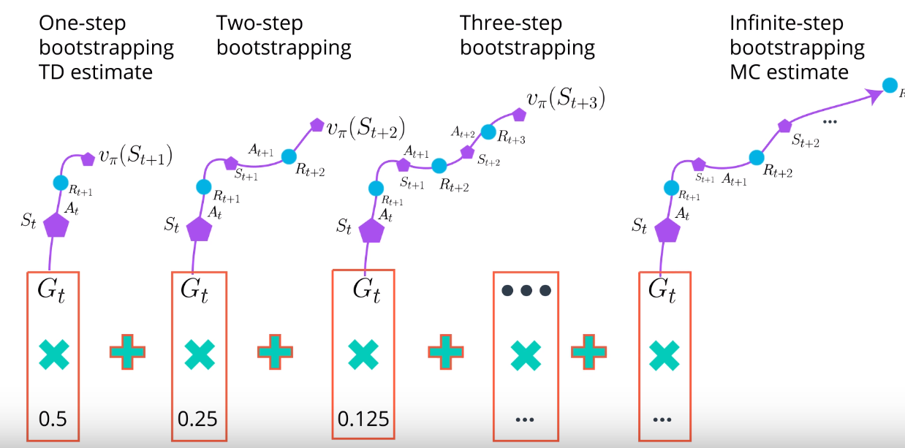
Note that if we take lambda factor to be 0, then the lambda return would reduce itself to one-step bootstrapping.  On the other case, when lambda is equal to 1, then lambda estimate would be equal to Monte-Carlo estimate (infinite-step). GAE can be applied to almost all policy-based methods.

### Deep Deterministic Policy Gradients

* The most obvious drawback of DQN that it cannot be used to solve continuous action spaces.
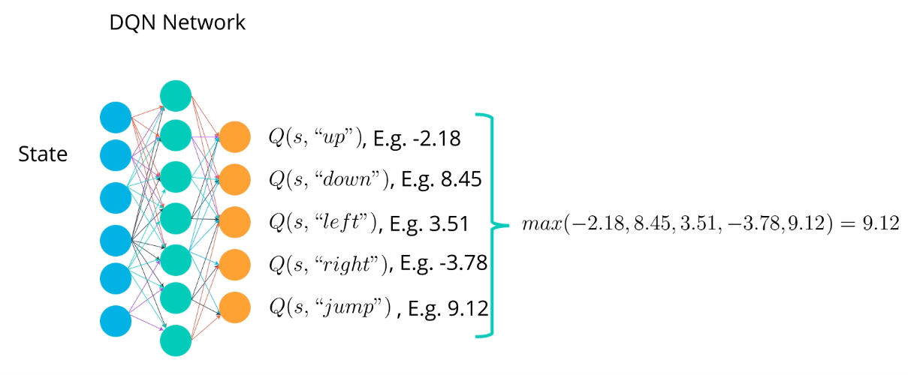
* DDPG is here to help. Actor helps to determine the optimal policy deterministically (we always want to output the best-believed action for any given state). The Actor is learning argmax_a[Q(s, a)]. The Critic learns to approximate the best value function by using the Actor the best-believed action.
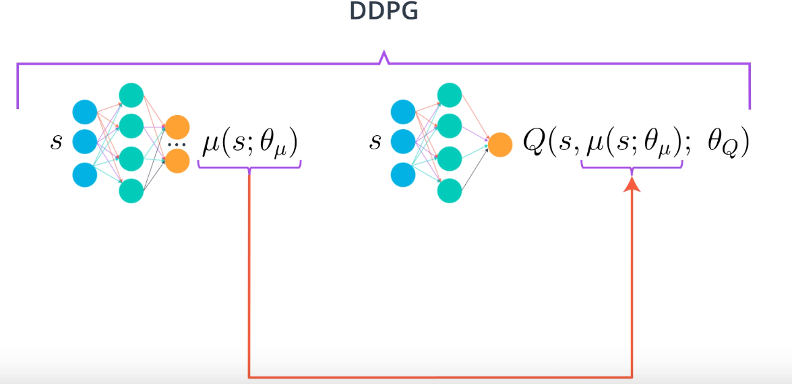

#### DDPG: Deep Deterministic Policy Gradient, Soft Updates

* Using the Replay buffer.
* Using the Soft update to the target network. The DQN algorithm has two neural networks, the regular and the target. The target network is updated every 10000 time-steps. It is in the form of copying the weights from Regular to Target. 
* In DDPG Soft update means that every time-step it does updating, but it limited to the factor of 0.01% of regular network weights.
  
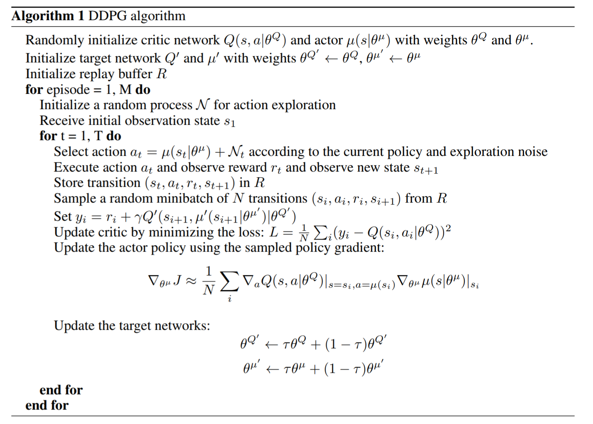

## Plot of Rewards

It was fun to finetune the hyperparameters while working on the Reacher environment with DDPG algorithm. I received the fastest learning with the Actor and Critic having 3 layers (fc1_units=300, fc2_units=150). The Actor uses Relu activation on the first two and tanh on the final layer. The Critic uses Relu on the first two layers only.

The following hyperparameters I used while training the agent:
Hyperparameter | Value
------------ | -------------
replay buffer size | int(1e5)
minibatch size | 128
discount factor | 0.99
for the soft update of target parameters | 1e-3
The learning rate of the actor | 1e-4
The learning rate of the critic | 1e-4

The environment considered as being solved if an agent would get an average of +30 reward over 100 consecutive episodes.

The results of my tunning are 107 episodes to attain an average score of 30.15. It is 7 episodes to solve the Reacher environment (episodes -100).

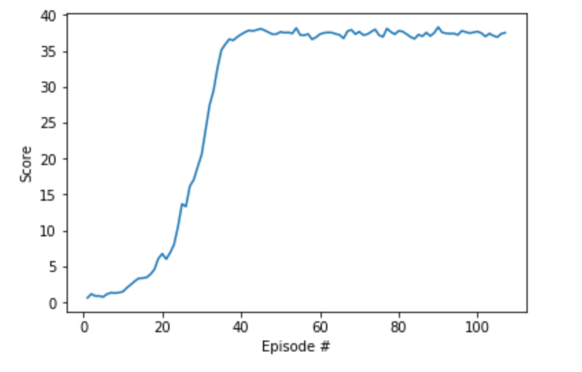

## Ideas for Future Work

I am thinking to try to improve DDPG by using PER (Priority Experience Replay) memory buffer and GAE(Generalized Advantage Estimation).
Furthermore, PPO and Actor-Critic methods would do fine in this environment.